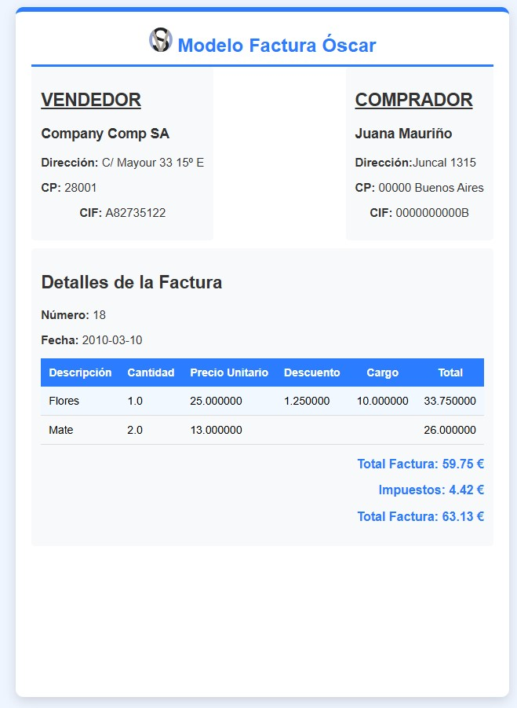

# README

Este documento explica cómo el archivo `factura2.xml` junto con el archivo `moderno.xsl` crean un formato de factura moderno y sencillo.

## Archivos involucrados

- **factura2.xml**: Este archivo contiene los datos de la factura en formato XML.
- **moderno.xsl**: Este archivo contiene las reglas de transformación XSLT que se aplican a `factura2.xml` para generar el formato de factura.

## Proceso de transformación

1. **Carga del archivo XML**: El archivo `factura2.xml` se carga en un procesador XSLT.
2. **Aplicación del archivo XSLT**: El procesador XSLT aplica las reglas definidas en `moderno.xsl` al contenido de `factura2.xml`.
3. **Generación del formato de factura**: El resultado de la transformación es un documento con un formato de factura moderno y sencillo, que puede ser en HTML, PDF u otro formato de salida.

## Ejemplo de uso

Para transformar `factura2.xml` utilizando `moderno.xsl`, es suficiente con enlazar como si de una hoja de estilos se tratase y listo.

Este comando generará un archivo `factura_moderno.html` con el formato de factura deseado.

## Conclusión

Utilizando `factura2.xml` y `moderno.xsl`, es posible crear un formato de factura moderno y sencillo mediante la transformación XSLT. Esto permite presentar los datos de la factura de una manera clara y profesional.

